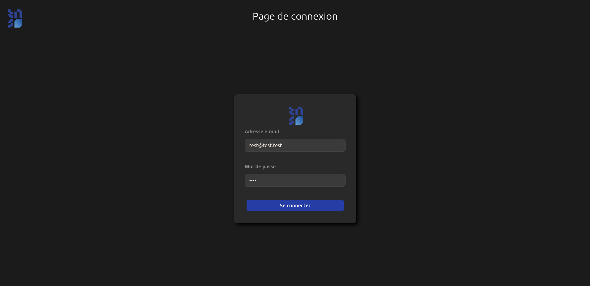
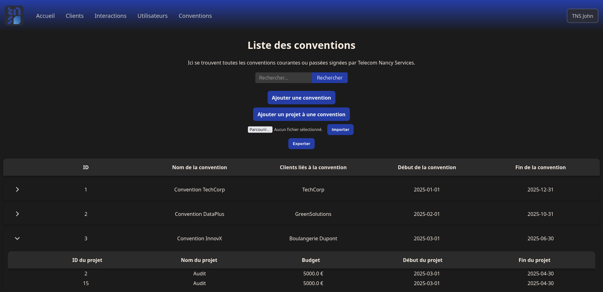
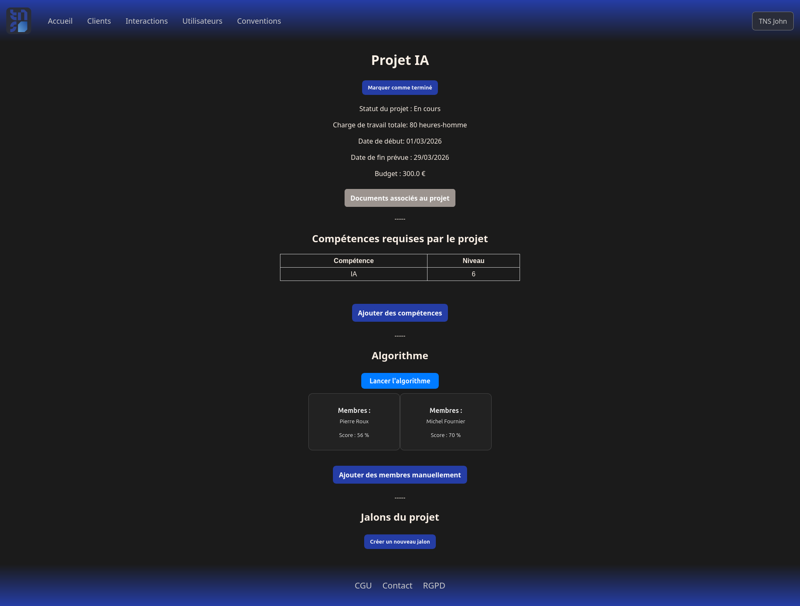

# TNS Service
Bienvenue sur le dépôt de PPII (Projet Pluridisciplinaire d'Informatique Intégrative) du groupe TTCD, **TNS Service**.

Ce projet a été réalisé du 27 octobre 2025 au 7 janvier 2026.

Il consiste en la réalisation d'un site web pour la Junior entreprise **TELECOM Nancy Services**, visant à gérer ses clients, ainsi que ses interactions avec ceux-ci, les conventions passées et les projets qu'elles comprennent.

Ce site était à réaliser en utilisant la bibliothèque **Flask** pour le langage **Python** et des templates **Jinja2**. La base de données est quant à elle gérée via **SQLite** avec implémentation d'un cache **Redis**. 

---

Le site propose diverses fonctionnalités visant à faciliter la gestion pour TNS de ses clients, de ses utilisateurs et de ses conventions.

Ces fonctionnalités comprennent:

- Un système de **connexion** obligatoire avec **mots de passe chiffrés**;

 
- Une **gestion détaillée de rôles et de permissions**;

- Une **liste de conventions et de projets, avec possibilité d'import et d'export au format CSV**;

- Fonctionnalités **CRUD (Créer, Lire, Modifier, Supprimer)** pour les projets et les utilisateurs du site;

- Un **algorithme de maching** permettant d'assigner à chaque projet le(s) intervenant(s) le(s) plus à même de le réaliser;

- Une **gestion des interactions** avec les clients.

---

Pour lancer le projet:

- Cloner le projet : ``git clone https://gibson.telecomnancy.univ-lorraine.fr/projets/2526/PPII/ppii-s5/groupe-07-ttcd.git``;
- Créer un venv : ``python3 -m venv venv && source venv/bin/activate``;
- Installer les dépendances : ``pip install -r requirements.txt``;
- Créer la base de données à l'aide du fichier ``database/create_database.sql``;
- La remplir avec les données de votre choix (un fichier d'ajout exemple est fourni, ``ajout_complet.py``);
- Installer un outil de conteneurisation (``docker-compose`` ou ``podman-compose`` par exemple) via votre gestionnaire de paquets;
- Créer un fichier .env ou renommer le fichier .env.exemple (pré-rempli) et le remplir avec les informations suivantes : 
  - ``DATABASE`` : La base de données SQLITE à utiliser,
  - ``REDIS_HOST`` : Le host de Redis, 
  - ``REDIS_PORT`` : Le port dédié à Redis,
  - ``REDIS_DB`` : La DB Redis utilisée,
  - ``SECRET_KEY`` : Une clé secrète aléatoire.
- Lancer un conteneur via la commande ``docker-compose up -d`` (à adapter selon l'outil choisi);
- Lancer le projet : ``flask run``;
- Le site est accessible à l'adresse ``http://127.0.0.1:5000/``.

La documentation est accessible dans le fichier [Documentation_PPII.pdf](https://gibson.telecomnancy.univ-lorraine.fr/projets/2526/PPII/ppii-s5/groupe-07-ttcd/-/blob/94124fe47628bf5d0c958f4c7d6f07db731f7dd0/Documentation_PPII.pdf)